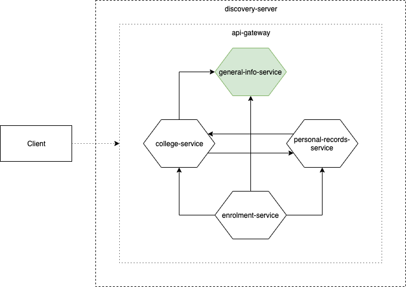

# 1. Overview
The general-info service consists of data that are used as common information across all services, and should be accessed only by users with the highest rights. These data include:
1. School Year - the school year of which a data may belong to (e.g. Offering) 
2. School Period - the period in the school year of which a data may belong to (e.g. Offering)
3. Schedule - the university's allowed enrolment schedules

This service uses [genuniv-common-service](https://github.com/carzanodev/genuniv-common-service) as its chassis.

# 2. Relations Diagram

# 3. Access Endpoints
1. `/api/v1/school-year`
2. `/api/v1/school-period`
3. `/api/v1/schedule`

# 4. Data Dependencies
The general-info service does not need data from the other services.   
